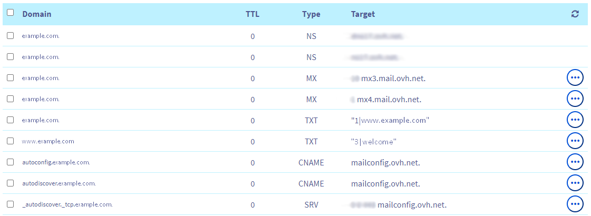

# How to map an OVH domain name to a Netlify project

This tutoral is a personal memo to remind to myself how to link a domain name host by OVH (which is the case when it is bought through the OVH domain purshase webpage) to a Netlify project. I published it so that it can be helpful to others.

## Introduction

There are different ways to point a custom domain name to a Netlify project (details [**here**](https://www.netlify.com/blog/2020/03/26/how-to-set-up-netlify-dns-custom-domains-cname-and-a-records)). Among them we can highlight the two following:
-	Using an **A record** to map a hostname to an IPv4 address of a server.
-	Using a **CNAME record** to specify an alias. It maps a human-readable hostname to another one that the browser should look up instead.

According to Netlify, the CNAME method is more adapted since it enables them to adapt the servers’ routes. Thus, the visitors experience fast page load times regardless of where they are located or what’s happening elsewhere on the network.

That is the method I detail in this tutorial, considering that we bought the domain name <code>example.com</code> through OVH purchasing webpage.

## Method
### Netlify configuration

This is what Netlify says :

> "When you configure a custom domain to point to a Netlify site, we recommend setting up your primary site as a subdomain that uses the <code>www.</code> prefix (or <code>app.</code> or <code>docs.</code>, etc.) and a CNAME mapping that site to the URL of your Netlify site, <code>automatically-generated-name.netlify.app</code> (where <code>automatically-generated-name</code> depends on the name of your Netlify site in the Netlify UI) [...] What’s great about this configuration is that if someone is visiting your site and our system has detected that our main load balancer is slow or unresponsive, we’ll simply route around that slowness on the network level. We also use advanced traffic direction to serve your site from the node that’s geographically closest to the person visiting."

So, considering the domain name <code>example.com</code>, it is <code>www.example.com</code> that should be the primary domain name in <code>Settings/Domain management</code> (picture below).

These Netlify explanations are also given in the pop-up that shows up when clicking on the warning message: 

If we want to use <code>example.com</code> as the primary domain, we are advised to use Netlify DNS. But I want to do the configuration with the OVH DNS, so no need to initialize the Netlify DNS.

That's it for configuring Netlify, now let's focus on the OVH configuration.

### OVH configuration

By default, in the OVH manager panel are shown the domain name records (<code>Domains/example.com/DNS zone</code>). Here are the records:

The entries <code>@ IN TXT “1|www.example.com”</code> and <code>www IN TXT “3|welcome”</code> are used to display the default page “Congratulations! Your ovh domain example.com has been created successfully!” ([**source**](https://community.ovh.com/t/a-quoi-servent-ces-entrees-txt-par-defaut/3627/4)).

When entering <code>example.com</code> in a browser (without the <code>www</code>) it redirects automatically to <code>www.example.com</code>. I assume that the entry <code>@ IN TXT “1|www.example.com”</code> is responsible for this redirection, and the entry <code>www IN TXT “3|welcome”</code> links to the congratulations page.

**So the idea is** : by leaving this redirection system intact and only replacing the congratulations page by my personnal website, I should get the expected result.

To do this, I just need to follow the Netlify explanations (citation above). The entry <code>www IN TXT “3|welcome”</code> should previously be deleted, otherwise the following error shows up.

> “This sub-domain is already using a DNS record. You cannot add a CNAME record due to an incompatibility issue. Please delete the existing records for this sub-domain to add a CNAME record.”

To still have the redirection system, keep the entry <code>@ IN TXT “1|www.example.com”</code>.

You might have to wait for some time to let the modifications propagate over the network (usually 24h).

### Conclusion

With this configuration, I can reach my own website by entering either “example.com” or “www.example.com” in a browser. Moreover, Netlify automatically applies the SSL certificate to my website (every attempt to reach it in http is switched into https). And as I used the CNAME configuration, the loading time is optimized.

## Bibliography

Jen Kagan, “How to Set Up Netlify DNS - Custom Domains, CNAME, & Records,” Netlify, Mar. 26, 2020. https://www.netlify.com/blog/2020/03/26/how-to-set-up-netlify-dns-custom-domains-cname-and-a-records/ (accessed Sep. 06, 2022).

OVH community, “À quoi servent ces entrées TXT par défaut ?,” OVHcloud Community, Jul. 06, 2017. http://community.ovh.com/t/a-quoi-servent-ces-entrees-txt-par-defaut/3627 (accessed Sep. 06, 2022).

More details about DNS zones and CNAME (in French) :   
Stéphane Bortzmeyer, “CNAME à l’apex d’une zone, pourquoi et comment ?,” Sep. 23, 2018. https://www.bortzmeyer.org/cname-apex.html (accessed Sep. 06, 2022).
